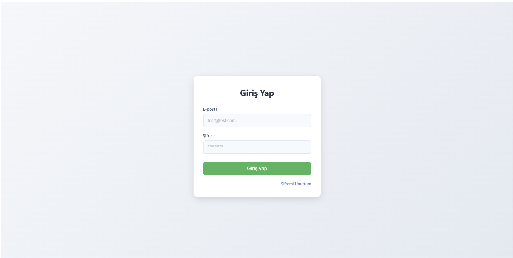
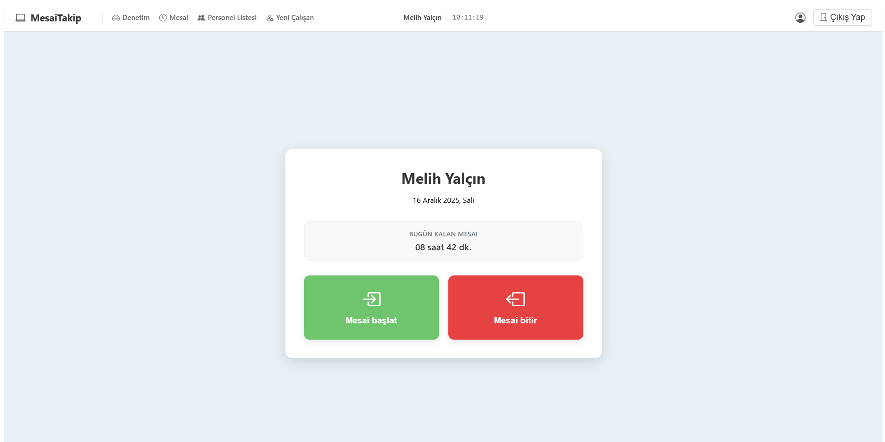
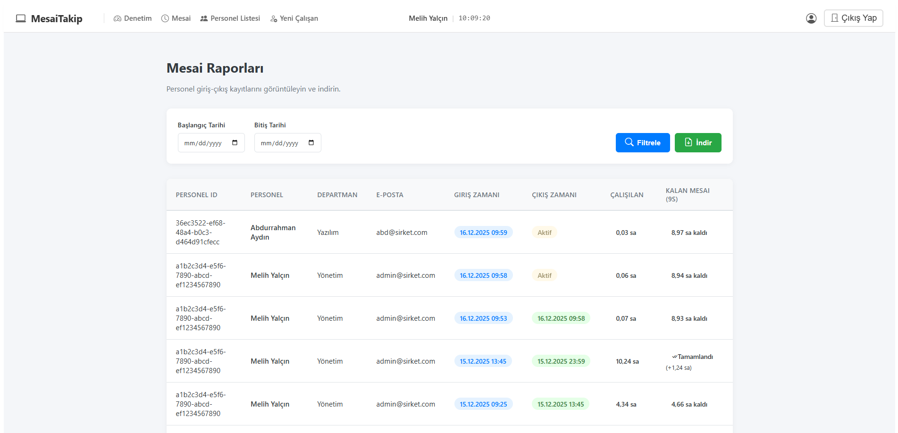
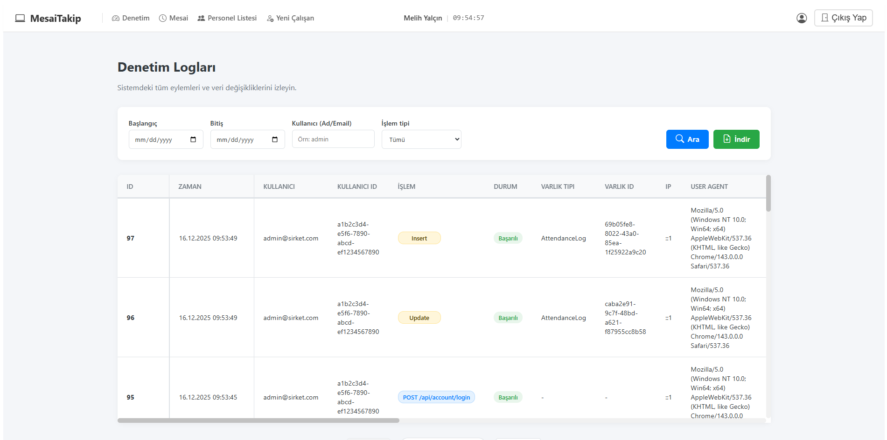

#  EmployeeAttendanceSystem

> Uygulama, **.NET 8 Web API** ve **Angular 17+** kullanılarak modern web standartlarına uygun şekilde tasarlanmıştır.  
> Clean Architecture prensipleriyle geliştirilmiş, Backend ve Frontend’i tamamen ayrık tam kapsamlı bir web uygulaması.

---

## 📌 İçindekiler
- [Genel Bakış](#genel-bakis)
- [Öne Çıkan Özellikler](#one-cikan-ozellikler)
- [Ekran Görüntüleri](#ekran-goruntuleri)
- [Proje Yapısı](#proje-yapisi)
- [Kullanılan Teknolojiler](#kullanilan-teknolojiler)
- [Kurulum ve Çalıştırma](#kurulum)
- [Varsayılan Giriş Bilgileri](#giris-bilgileri)

---

## 🔎 Genel Bakış <a id="genel-bakis"></a>

Bu proje, şirket personelinin günlük mesai giriş-çıkış saatlerini takip etmek, yöneticilere detaylı raporlar sunmak ve sistem üzerindeki tüm kritik işlemleri denetlemek amacıyla geliştirilmiş tam kapsamlı bir web uygulamasıdır.

---

## 🚀 Öne Çıkan Özellikler <a id="one-cikan-ozellikler"></a>

### 🔐 Kimlik & Güvenlik
-  **JWT (JSON Web Token):** Güvenli ve stateless oturum yönetimi.
-  **Rol Bazlı Yetkilendirme:** Admin ve Employee (Personel) rolleri ile sayfa ve API güvenliği.
-  **ASP.NET Core Identity:** .NET Identity ile endüstri standardı şifre hashleme ve doğrulama.

### 👤 Personel Modülü
-  **Kolay Kullanım:** Tek tıkla "Mesai Başlat" (Check-In) ve "Mesai Bitir" (Check-Out).
-  **Canlı Durum:** Anlık mesai süresi takibi
-  **Profil Yönetimi:** Kendi bilgilerini görüntüleme ve şifre değiştirme.

### 🛠️ Admin Modülü
-  **Personel Yönetimi:** Yeni personel ekleme, bilgileri güncelleme ve silme
-  **Detaylı Raporlama:** Tarih aralığına göre personelin giriş-çıkış saatlerini ve toplam çalışma sürelerini listeleme.
-  **Excel Export:** Raporları ve denetim loglarını .xlsx formatında indirebilme.
-  **Denetim Logları:** Sistemdeki her işlemi (Giriş denemeleri, veri değişiklikleri vb.) detaylarıyla izleyebilme.


### ⚙️ Teknik Altyapı
-  **Hibrid Loglama:** Hem veritabanı değişikliklerini, hem de kritik API çağrılarını yakalayan gelişmiş loglama mimarisi.
-  **Angular Signals:** Frontend'de yüksek performanslı state management.
-  **Standalone Components:** Angular'ın modülsüz, modern mimarisi.

---
## 🖼️ Ekran Görüntüleri <a id="ekran-goruntuleri"></a>

<p align="center">
  
  
</p>

<p align="center">
  
  
</p>

<p align="center">
  <sub>🔑 Giriş • 👤 Dashboard • 🛠️ Mesai Logları • 📊 Denetim Logları</sub>
</p>

---
## 🗂️ Proje Yapısı <a id="proje-yapisi"></a>

```text
EmployeeAttendanceSystem
│
├── EmployeeAttendanceSystem.Server
│   │
│   ├── API
│   │   ├── Controllers
│   │   ├── Extensions
│   │   ├── Filters
│   │   └── Program.cs
│   │
│   ├── Application
│   │   ├── DTOs
│   │   └── Interfaces
│   │
│   ├── Domain
│   │   └── Entities
│   │
│   ├── Infrastructure
│   │   ├── Context
│   │   ├── Interceptors
│   │   ├── Migrations
│   │   └── Services
│   │
│   ├── appsettings.json
│   ├── appsettings.Development.json
│   └── EmployeeAttendanceSystem.Server.http
│
├── EmployeeAttendanceSystem.Client
│   │
│   ├── src
│   │   │
│   │   ├── app
│   │   │   ├── core
│   │   │   │   ├── guards
│   │   │   │   ├── interceptors
│   │   │   │   ├── models
│   │   │   │   ├── pipes
│   │   │   │   └── services
│   │   │   │
│   │   │   ├── features
│   │   │   │
│   │   │   ├── shared
│   │   │   │
│   │   │   ├── app.component.ts
│   │   │   ├── app.component.html
│   │   │   ├── app.component.scss
│   │   │   ├── app.config.ts
│   │   │   └── app.routes.ts
│   │   │
│   │   ├── environments
│   │   │   ├── environment.ts
│   │   │   └── environment.development.ts
│   │   │
│   │   ├── index.html
│   │   ├── main.ts
│   │   └── styles.scss
│   │
│   ├── angular.json
│   ├── package.json
│   └── tsconfig.json
│
├── README.md
└── .gitignore

```
---

## 🧰 Kullanılan Teknolojiler <a id="kullanilan-teknolojiler"></a>

###  Backend
- C# / **.NET 8 Web API**
- Entity Framework Core
- MSSQL Server
- ASP.NET Core Identity
- JWT Authentication
- EPPlus (Excel İşlemleri)

###  Frontend
- **Angular 17+**
- TypeScript
- SCSS (SASS)
- RxJS
- Bootstrap Icons

---

## 💻 Kurulum ve Çalıştırma <a id="kurulum"></a>

### 1. Ön Gereksinimler
- .NET 8 SDK
- Node.js
- Angular CLI
- SQL Server

---

## 🔑 Varsayılan Giriş Bilgileri <a id="giris-bilgileri"></a>
> Veritabanı oluşturulduğunda , sisteme otomatik olarak bir Admin kullanıcısı eklenir:

| Rol | E-Posta | Şifre |
|----|--------|------|
| Admin | admin@sirket.com | Admin123! |


---


### 2. Backend Kurulumu

1.Repoyu klonlayın ve backend klasörüne gidin:
```bash
git clone https://github.com/KULLANICI_ADI/REPO_ADI.git
cd EmployeeAttendanceSystem.Server
```

2.`appsettings.Development.json` dosyasında **ConnectionStrings** alanını güncelleyin.

3.Veritabanını oluşturun ve varsayılan verileri (Admin kullanıcısı) yükleyin:

```bash
dotnet ef database update
```
4.API'yi ayağa kaldırın:
```bash
dotnet watch run
```

API adresi: https://localhost:7209 (Swagger: /swagger)`

---

### 3. Frontend Kurulumu

1.Yeni bir terminal açın ve frontend klasörüne gidin:
```bash
cd EmployeeAttendanceSystem.client
```
2.Bağımlılıkları yükleyin:
```
npm install
```
3.Uygulamayı başlatın:
```
ng serve --open
```


🌐 Uygulama: `http://localhost:4200`

---


